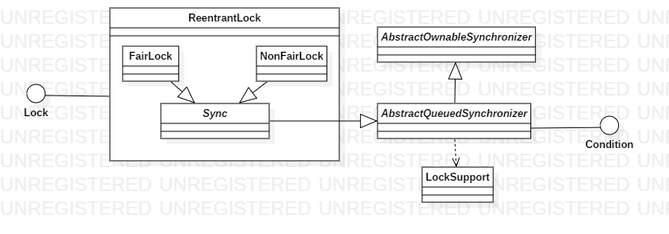

## AQS框架之ReentrantLock实现类

ReentrantLock，中文翻译为可重入的锁，其类图如下



在ReentrantLock类中，我们就可以回答上文如何上锁的问题了，值得一提的是，ReentrantLock在AQS框架的帮助下实现了Lock接口

同样的，我们先来看一段代码

```java
final boolean nonfairTryAcquire(int acquires) {
    final Thread current = Thread.currentThread();
    int c = getState();
    //排他
    if (c == 0) {
        //上锁
        if (compareAndSetState(0, acquires)) {
            setExclusiveOwnerThread(current);
            return true;
        }
    }
    //重入
    else if (current == getExclusiveOwnerThread()) {
        int nextc = c + acquires;
        if (nextc < 0) // overflow
            throw new Error("Maximum lock count exceeded");
        setState(nextc);
        return true;
    }
    return false;
}
```

可以看到，上锁有两个步骤来完成的

1. 设置status的值
2. 设置独享线程为当前线程

在这里就使用到了AQS框架中的另外两个域

| 域名                 | 类型         | 备注     |
| -------------------- | ------------ | -------- |
| status               | volitite int | 状态     |
| exclusiveOwnerThread | Thread       | 独占线程 |

::: tip

exclusiveOwnerThread是AQS的父类AbstractOwnableSynchnozier中的域

:::

只有当status为0时，说明这个锁从未被获取过，通过对status值的判断实现了排他性，当然还有一个重入的概念，我们下边再介绍

知道了如何上锁，那我们想一想应该如何解锁的？既然上锁改变了两个值，那么解锁自然就是将改变的这两个值还原就可以了，来看看ReentrantLock是不是这样实现的呢？

```java
protected final boolean tryRelease(int releases) {
    int c = getState() - releases;
    if (Thread.currentThread() != getExclusiveOwnerThread())
        throw new IllegalMonitorStateException();
    boolean free = false;
    //重入是否都已释放
    if (c == 0) {
        free = true;
        //还原独占线程
        setExclusiveOwnerThread(null);
    }
    //还原status
    setState(c);
    return free;
}
```

果然不出我们所料，在解锁时将独占线程设置为null，并减少status到0

ReentrantLock不止是实现了AQS框架，并且引入了两个新的概念

- 抢占：一个线程在尝试获取锁时可以不用排队获取锁
- 重入：当一个线程获取到锁后本线程还可以再一次获取该锁

重入的代码逻辑在上述两段代码已有体现，其流程图如下

```mermaid
graph LR
	A(申请锁)-->B(status不为0)
	B-->C{判断独占线程<br>是否为当前线程}
	C--是-->D(status++)
	C--否-->E(获取失败)
```

重入也赋予了status新的概念：记录持有锁线程的重入次数

而抢占的概念则是如下一段代码

```java
final void lock() {
    //抢占
    if (compareAndSetState(0, 1))
        setExclusiveOwnerThread(Thread.currentThread());
    else
        acquire(1);
}
```

在实际申请锁之前使用CAS对status进行修改，修改成功就说明是抢占到了。ReentrantLock类的使用其实是使用其内部的FairLock和NorFairLock，抢占这个行为只存在于NorFairLock。

::: tip

抢占行为不止在于上述代码

:::

下边有一张非公平锁申请锁的完整流程图

```mermaid
graph LR
	A(请求锁)-->B{抢占}
	B--成功-->C(获取到锁)
	B--失败-->D(排队)
	D-->G(park)
	G-->E(被前序节点唤醒)
	E-->F{尝试获取锁}
	F--成功-->C
	F--失败-->G
```